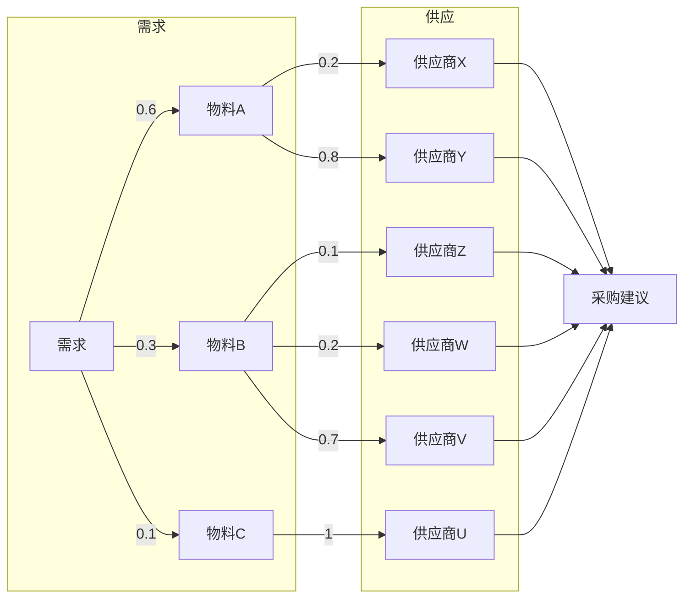
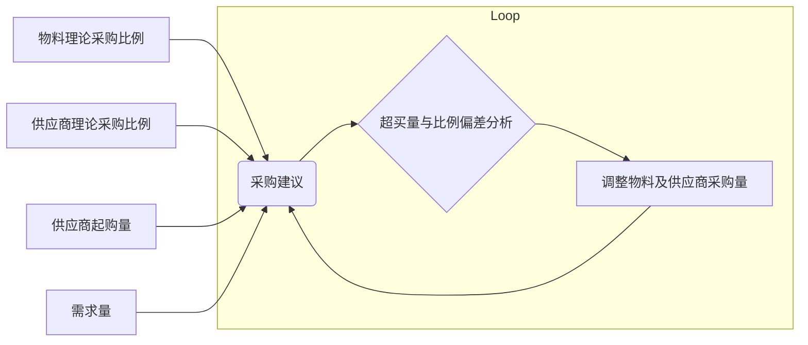
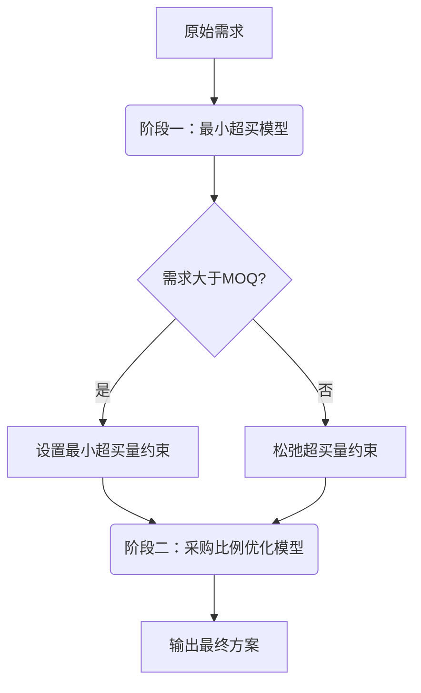
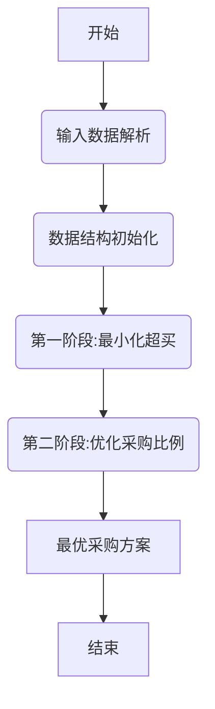
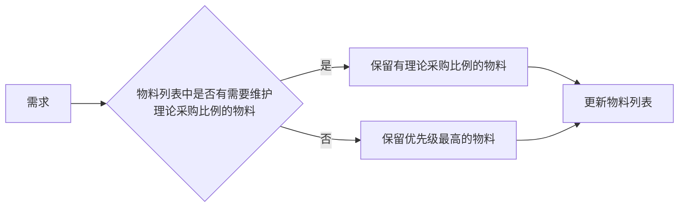
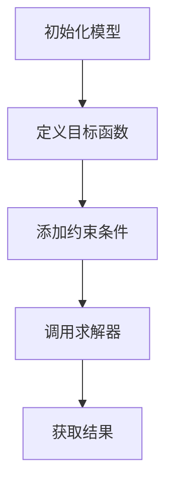
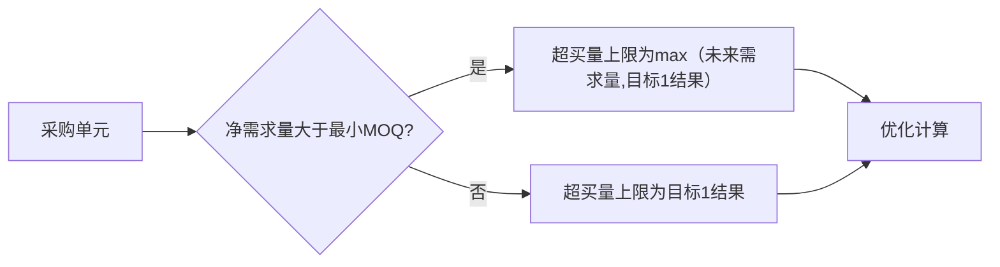

# 记忆科技采购建议项目

RAMAXEL-ProcureSense-algorithm

## 1. 项目背景

采购作为供应链管理的重要环节，合理的采购模型与优化策略可以有效提升采购效率。在实际采购过程中往往需要考虑多个因素，如物料替代关系、供应商选择、采购比例限制等。本项目基于混合整数规划模型，优化采购方案，使采购决策在满足需求的同时，均衡物料采购比例和供应商采购比例，生成最优采购建议。

## 2. 应用场景

在采购过程中，多种物料之间可能存在替代关系，即某种需求可以由不同物料部分或完全替代。每种物料可以由多个供应商提供，每个供应商会有最小包装量（MPQ）和最小起购量（MOQ）限制。根据物料不完全替代关系和供应商采购限制有多种需求满足方案。 采购时需要确保每个需求都得到满足，且尽量避免采购过量出现超买，同时，根据历史采购数据及理论比例（PN & MPN），优化采购方案，逐步接近理论值。计算每个物料下每个供应商的建议采购量，汇总所有物料的采购建议，形成最终采购方案。

* **需求约束**：确保每个采购单元的需求得到满足，同时避免超额采购

* **供应商约束**：不同供应商对相同物料的采购比例应尽可能符合理论采购比例（MPN）

* **采购优化**：基于历史采购数据及理论采购比例（PN & MPN），优化采购建议，使其逐步趋近理论值

以下是一个典型的采购问题示例：

（图 2.1 采购问题）

## 3. 问题分析

### 3.1 需求分析

采购建议的计算主要基于以下几个关键参数：

* **需求量**：净需求量

* **供应商约束**：最小起购量（MOQ）、最小包装量（MPQ）

* **采购比例**：

  * **PN 比例**：物料的理论采购比例

  * **MPN 比例**：供应商对应物料的理论采购比例

根据需求量、供应商起购量、供应商理论采购比例（MPN 比例）等参数，计算每个物料下每个供应商的建议采购量。进行超买量与比例偏差分析，在满足净需求的同时，最小化超买量，并趋近于物料的理论采购比例（PN 比例）及供应商的理论采购比例（MPN 比例），调整物料及供应商采购量，迭代到最优，汇总所有物料的采购建议，形成最终采购方案，如下图所示。

（图 3.1 需求分析）

### 3.2 算法设计

采购建议计算分为两个处理过程，采用两阶段线性规划模型： **第一阶段**：最小化超买量 **第二阶段**：在超买量约束下优化采购比例

（图 3.2 算法设计）

## 4. 数学模型

### 4.1 问题描述

需求满足：

* 一个需求可以由多个物料满足，物料之间存在不完全替代关系。

* 每个物料的采购量存在理论PN比例。

供应商满足：

* 每个物料可以由多个供应商提供，供应商之间存在理论MPN比例。

* 供应商的采购量需满足MOQ和MPQ限制。

* 物料采购量必须是最小包装量（MPQ）的倍数，且不小于最小起购量（MOQ）。

### 4.2 符号定义

| 符号          | 描述                                        |
| :---------- | :---------------------------------------- |
| **【需求属性】**  |                                           |
| $i$         | 需求编号，$i=1,2,\cdots,I$                     |
| $h'$        | 需求下的物料编码，$h'\in \{1,2,\cdots,H\}$         |
| $D_i$       | 第 $i$ 个需求，需求集合 $D=\{D_1,D_2,\cdots,D_I\}$ |
| $Q_i$       | 需求 $D_i$ 的净需求量                            |
| **【物料属性】**  |                                           |
| $h$         | 物料编码，$h=1,2,\cdots,H$                     |
| $r_{h}$     | 第 $h$ 个物料的 PN 理论采购比例                      |
| **【供应商属性】** |                                           |
| $k$         | 供应商编号，$k=1,2,\cdots,K$                    |
| $R_{hk}$    | 物料 $h$ 对应供应商 $k$ 的 MPN 理论采购比例             |
| $PQ_{hk}$   | 物料 $h$ 对应供应商 $k$ 的已购量                     |
| $Moq_{hk}$  | 物料 $h$ 对应供应商 $k$ 的最小起购量                   |
| $Mpq_{hk}$  | 物料 $h$ 对应供应商 $k$ 的最小包装量                   |

**决策变量**

* $X_{hk}$：供应商 $k$ 对物料 $h$ 的建议采购量。

* $x_{ih'}$：需求 $i$ 的物料 $h'$的分配量。

### 4.3 目标1

在目标1中最小化超买量，确保采购量尽可能接近需求量

$$
\begin{aligned}
& \min \sum_{h=1}^{H} \sum_{k=1}^{K} X_{hk} - \sum_{i=1}^{I} Q_i \\
& \text{s.t} \\
& Q_i = \sum_{h'} x_{ih'}, \quad \forall i \quad \text{(1)} \\
& \sum_{i=1}^{I} x_{ih'} \leq \sum_{k=1}^{K} X_{hk}, \quad \forall h=h' \quad \text{(2)} \\
& X_{hk} \geq Moq_{hk}, \quad \forall h, k \quad \text{(3)} \\
& X_{hk} \in Mpq_{hk} \mathbb{Z}, \quad \forall h, k \quad \text{(4)}
\end{aligned}
$$

* 约束（1）：确保每个需求 $i$ 的净需求量 $Q_i$ 等于其分配物料的总量。

* 约束（2）：确保每个物料的采购总量满足其需求分配总量。

* 约束（3）：确保每个供应商对物料的采购量不小于最小起购量（MOQ）。

* 约束（4）：确保每个供应商对物料的采购量是最小包装量（MPQ）的整数倍。

### 4.4 目标2

在目标2中，最小化采购比例偏差，确保采购比例趋近于理论值。

$$
\begin{aligned}
&\min  w_{pn} f_{pn} + w_{mpn} f_{mpn}  \\
& \text{s.t} \\
& Q_i = \sum_{h'} x_{ih'}, \quad \forall i \quad \text{(1)} \\
& \sum_{i=1}^{I} x_{ih'} \leq \sum_{k=1}^{K} X_{hk}, \quad \forall h=h' \quad \text{(2)} \\
& X_{hk} \geq Moq_{hk}, \quad \forall h, k \quad \text{(3)} \\
& X_{hk} \in Mpq_{hk} \mathbb{Z}, \quad \forall h, k \quad \text{(4)} \\
& \sum_{h=1}^{H} \sum_{k=1}^{K} X_{hk} - \sum_{i=1}^{I} Q_i \leq f_1 \quad \text{(5)} \\
\end{aligned}
$$

* 约束（1）-（4）：与目标1一致。

* 约束（5）：确保目标2的超买量不超过目标1的最优超买量。

* PN 比例偏差：

  $$
  f_{pn} = \frac{1}{H} \sum_{h=1}^{H} \left| \sum_{k=1}^{K} \left( X_{hk} + PQ_{hk} \right) - r_h \sum_{h=1}^{H} \sum_{k=1}^{K} \left( X_{hk} + PQ_{hk} \right) \right|
  $$

  表示物料的实际采购量与其理论 PN 采购比例之间的偏差。

* MPN 比例偏差：

  $$
  f_{mpn} = \sum_{h=1}^{H} \frac{1}{\sum_{k=1}^{K} \lceil R_{hk} \rceil} \sum_{k=1}^{K} \left| \left( X_{hk} + PQ_{hk} \right) - R_{hk} \sum_{k=1}^{K} \left( X_{hk} + PQ_{hk} \right) \right|
  $$

  表示供应商的实际采购量与其理论 MPN 采购比例之间的偏差。

## 5. 执行流程

采购建议计算的整体流程如下：

（图 5.1 算法整体流程）

1. **输入数据解析**：解析传入的输入数据，提取采购单元、物料需求、供应商信息等。

2. **数据结构初始化**：初始化需求`DemandManager`和供应商`VendorManager`

3. **优化计算**：两阶段优化计算，最小化超买量和比例趋近系数

4. **输出结果**：将根据求解结果生成的采购建议方案返回给调用方

### 5.1 输入数据解析

输入数据通过`InputData`对象传入，包含以下关键字段：

* `tenantId`：租户ID

* `version`：版本号

* `manualFlag`：标识

* `pnRatioWeight`：PN 理论采购比例的权重

* `mpnRatioWeight`：MPN 理论采购比例的权重

* `data`：采购单元列表，每个采购单元包含物料需求、供应商信息等

#### 数据预处理

1. **需求合并**：根据物料列表合并需求，合并后的总净需求用于优化计算，减少变量的数量。

2. **物料优先级过滤**：根据物料是否有PN比例及优先级筛选并更新需求的物料列表。

   * 如果某物料有 PN 比例，则物料列表保留维护了 PN 比例的物料。

   * 否则，物料列表只保留优先级最高的物料。

（图 5.2 物料过滤逻辑）

### 5.2 数据结构初始化

对于一个采购单元，初始化求解器，初始化需求`DemandManager`和供应商`VendorManager`

#### 需求DemandManager

建立需求-物料映射

* 创建需求ID -> 需求数量映射

* 创建需求ID -> 物料编码与变量的映射

* 创建物料编码 -> 物料编码与变量的映射

* 创建决策变量和需求相关约束

  * 净需求量=物料变量的总和

#### 供应商VendorManager

* 创建物料编码 -> 供应商信息列表映射，包含供应商编码、理论采购比例、已购量、MOQ、MPQ 和变量

* 创建决策变量和设置供应商相关的约束

  * 建议采购量 >= 净需求

  * 每个物料的采购量 >= 物料变量的总和

### 5.3 优化计算

采购计划计算的核心部分，分为两个目标，调用求解器分段计算

（图5.3 求解器优化流程）

#### 5.3.1 目标1：最小化超买量

* **目标函数**：最小化超买量，超买量 = 总建议采购量 - 需求量

* **约束条件**：求`DemandManager`和供应商`VendorManager`内设置

* **求解方法**：使用线性规划求解器进行优化计算

* **输出结果**：最小超买量

#### 5.3.2 目标2：最小化采购比例偏差

* **目标函数**：最小化实际采购比例与理论采购比例的偏差，偏差 = PN偏差 + MPN偏差

* **约束条件**：

  * 求`DemandManager`和供应商`VendorManager`内设置

  * 设置超买量上界：如果净需求量是否大于最小MOQ，超买量上限可放宽到未来需求量，否则设置为目标1结果

* **求解方法**：使用线性规划求解器进行优化计算

* **输出结果**：获取在约束超买量下的最小采购比例偏差数值及建议采购列表

（图5.4 超买量约束逻辑）

### 5.4 输出结果

输出数据通过`OutputData`对象返回，包含以下字段：

* `tenantId`

* `version`

* `manualFlag`

* `data`：采购单元的结果列表，每个采购单元包含超买量、超买比例、采购建议，采购建议包含

1. **超买量**：总采购量与总需求量的差值

2. **超买比例**：超买量与总净需求量的比例，保留两位小数

3. **采购建议列表**：包含物料编码、供应商编码、建议采购量等信息

## 6. 代码架构

1. **核心类**：

   * `PurchasePlanImpl`：主业务逻辑类，负责调用其他类和方法完成采购建议的计算

   * `InputData`：输入数据类，包含租户ID、版本号、手动标记、PN比例权重、MPN比例权重以及采购单元列表

   * `OutputData`：输出数据类，包含租户ID、版本号、手动标记以及采购建议结果列表

   * `PurchaseUnit`：采购单元类，包含采购单元ID、需求列表、PN比例、MPN比例以及未来需求量

   * `OutputPurchaseUnit`：采购单元结果类，包含采购单元ID、超买量、超买比例以及采购建议列表

   * `Suggestion`：采购建议类，包含物料编码、供应商编码、建议采购量、MOQ量和MPQ量

2. **数据模型类**：

   * `DemandManager`：需求管理类，用于管理采购单元的需求，包含需求ID到需求数量、需求ID到物料编码到变量的映射、物料编码到需求ID到变量的映射以及决策变量和需求相关的约束

   * `VendorManager`：供应商管理类，用于管理采购单元的供应商，包含物料编码到供应商信息列表的映射、决策变量和供应商相关的约束

3. **求解器类**：

   * `MinOverPurSolver`：目标1求解器，最小化超买量

   * `MinRatioSolver`：目标2求解器，最小化采购比例偏差

   * `SolverUtils`：工具类，提供变量求和和偏差计算的功能

4. **优化计算类**：

   * `MPSolver`：线性规划求解器，用于创建变量、约束和目标函数

   * `MPVariable`：线性规划变量，表示决策变量

   * `MPConstraint`：线性规划约束，用于设置约束条件

   * `MPObjective`：线性规划目标函数，用于设置目标函数

## 7. 总结

采购建议算法通过线性规划模型，结合物料和供应商的理论采购比例，解决了采购建议的优化问题。在保证满足净需求的基础上，尽量减少超买量，并使物料和供应商的建议采购量趋近于其理论比例。
