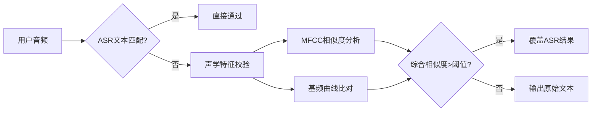

# ASR+声学对比
[toc]
## 一. 项目背景
需要实现一个实时语音朗读评估系统,即用户朗读完后，ASR音频转文本对比，反馈朗读报告。希望降低误判概率，即用户读对而系统判错的情况。
ASR系统存在识别错误的概率，结合预先录制的标准朗读进行声学对比，作为ASR结果的辅助验证，降低误判率。

### 场景

ASR 可能因为口音、语速、噪声而产生误识别，而声学上其实发音是对的。所以可以通过声学特征辅助判断用户其实是正确的。

- 教材原文：  

  《静夜思》第一句：“床前明月光”  
- 用户发音：  

  正确朗读“明（míng）”，但ASR因用户语速过快误识别为“民（mín）”  
- 声学证据：  

  用户发音的频谱（MFCC）和声调（F0曲线）与标准“明”高度匹配，纠正ASR错误


## 二 . 技术路线

在ASR结果进行文本识别基础上增加校验，结合用户语音与标准朗读音频的频谱特征（如MFCC+基频）进行相似度计算，通过声学特征纠正ASR误判


## 三. 实现


### 1. 概述
实现了一个融合自动语音识别(ASR)和声学特征分析的智能发音评测系统，主要功能包括：

    • 语音文本转换（Whisper ASR）

    • 声学特征提取（MFCC+基频）

    • 动态时间规整(DTW)比对

    • ASR错误纠正


### 2. 核心算法流程


#### 2.1 特征提取算法
- MFCC特征提取
```python
参数配置：
- 采样率：16000Hz
- 帧长：512点（32ms）
- 帧移：160点（10ms）
- 梅尔滤波器数：13
- 差分阶数：1阶
```

- 基频提取
```python
采用PYWORLD的harvest算法：
- 帧间隔：10ms
- 有效频段：70-400Hz
- 静音阈值：0.03
```

#### 2.2 动态时间规整算法
```python
距离矩阵计算：
d(i,j) = ||MFCC_i - MFCC_j||₂

路径约束：
- 单调性（音频帧的匹配顺序必须是从前往后（时间是单调递增的））
- 连续性（只能从当前帧走到下一帧（步长为1））
- 边界对齐（必须匹配从起点开始，到终点结束。）
```

#### 2.3 错误纠正逻辑
```python
if ASR文本 ≠ 标准文本:
    if MFCC相似度 > 0.8 OR 基频相关系数 > 0.7:
        采纳标准文本
    else:
        保留ASR结果
```

### 3. 关键数据结构

#### 3.1 音频特征矩阵
| 字段 | 维度 | 类型 | 描述 |
|------|------|------|------|
| mfcc | (N,26) | float32 | 13维MFCC+13维一阶差分（共26维 |
| f0 | (M,) | float64 | 基频序列 |

#### 3.2 DTW对齐路径
```python
{
    'index1': [t1,t2,...],  # 标准音频帧索引
    'index2': [t1',t2',...] # 用户音频帧索引 
}
```


### 4. 典型输出示例
    ```json
    {
        "ASR原始文本": "闯前明月光",
        "标准文本": "床前明月光",
        "声学证据": {
            "MFCC相似度": "92.34%",
            "Pitch相似度": "88.21%"
        },
        "最终结论": "发音正确，ASR误识已修正"
    }
    ```


## 四. 基础知识
1. MFCC
    MFCC，全称是 **Mel-Frequency Cepstral Coefficients（梅尔频率倒谱系数）**，是语音识别和音频分析中非常常用的一种**特征提取方法**。

    简单说：**它是把一段语音信号转成一组数字（特征向量），便于机器处理和识别。**

    ---

    ### 🔍 MFCC的作用是什么？

    它的核心目标是提取语音信号中**与人耳感知相关的特征**。  
    比如，我们说“猫”和“帽”发音很像，MFCC可以帮我们提取出能区分这些发音的有效特征。

    ---

    ### 🎯 MFCC的关键步骤（简化版）

    1. **预加重（Pre-emphasis）**：增强高频，防止高频信息丢失。
    2. **分帧（Framing）**：把连续语音分成小段（一般25毫秒），因为语音是非平稳的。
    3. **加窗（Windowing）**：为减少边缘效应，给每帧加窗（如Hamming窗）。
    4. **傅里叶变换（FFT）**：把每帧变成频域（知道各个频率成分）。
    5. **Mel滤波器组（Mel Filterbank）**：模拟人耳对不同频率的感知，用 Mel 频率刻度（人耳对低频更敏感）。
    6. **取对数（log）**：模拟人耳对音强的“对数感知”。
    7. **离散余弦变换（DCT）**：把频率特征“压缩”，让特征之间尽量不相关，得到一组**倒谱系数（cepstral coefficients）**。

    ---

    ### 📊 最终输出是什么？

    通常每一帧语音会提取出 13 个 MFCC 特征（也有用 12 或 20 的），  
    然后可能还会加上它们的一阶差分（速度）和二阶差分（加速度）特征。

    ---

    ### 📦 举个比喻

    你可以把 MFCC 想象成“声音的指纹”——不同的词、音、说话人都会产生不同的 MFCC，  
    这些数字就可以喂给机器学习模型去分类、识别、对比、合成等。


2. DTW
    在语音识别中，**DTW（动态时间规整）**曾是一种非常核心的算法，尤其在深度学习之前的传统语音识别系统中，用来**匹配语音特征和模板之间的相似度**。

    ---

    ### 🗣️ DTW在语音识别中的作用是啥？

    > **解决不同人说话速度不同**的问题 —— 比如你和我都说“OpenAI”，但一个人说得快，一个说得慢。

    **DTW 的目标就是：**
    在给定语音和参考模板之间找到**最优对齐方式**，看它们到底多相似。

    ---

    ### 🔍 举个例子：

    我们要识别“hello”这个词。

    - 把“hello”的标准语音（比如语音库中）提取 MFCC 特征：  
    \( T = [t_1, t_2, ..., t_n] \)
    - 用户说了句话，我们也提取 MFCC：  
    \( Q = [q_1, q_2, ..., q_m] \)

    DTW 会在 \( Q \) 和 \( T \) 之间寻找一条**最优匹配路径**，允许时间拉伸或压缩，得到**最小的距离分数**。

    ---

    ### 🧠 为什么有用？

    语音中，不同人说话快慢、停顿都不一样，直接比帧是不准的。  
    DTW 的优点是它能：

    | 功能 | 说明 |
    |------|------|
    | ⏱ 时间规整 | 比如把“he—llo” 和 “hello”对齐 |
    | 📉 误差最小路径 | 动态规划找到整体最相似的匹配 |
    | 🎤 无监督匹配 | 不需要模型训练就能识别相似语音 |

    ---

    ### 🏛️ DTW语音识别系统的结构：

    1. **特征提取**：对输入语音提取 MFCC 特征
    2. **模板库**：存储每个词的标准特征模板
    3. **DTW 比对**：输入语音与每个模板计算 DTW 距离
    4. **最小距离匹配**：距离最小的模板就是识别结果

    ---

    ### ✅ 优点 vs ❌ 缺点

    | 优点                             | 缺点                          |
    |----------------------------------|-------------------------------|
    | 适应速度变化                     | 不适合大词汇量（模板多）       |
    | 无需训练                         | 计算复杂度高，效率低           |
    | 可解释性强                       | 不支持上下文、语法等语言模型   |

    ---

    ### 🤖 今天还用 DTW 吗？

    现在主流语音识别系统（如 Google ASR、科大讯飞、DeepSpeech）都用 **深度学习（DNN + HMM 或 CTC + RNN）**，但：

    - **DTW 仍然用于小词汇量语音识别、孤立词识别（如语音控制、语音密码）**
    - 在某些 **嵌入式设备、少样本学习、动态手势识别** 中仍很有用
    - 还常用来 **对比声纹、说话人验证、情感语音分析** 等任务


3. 声学特征

    | 特征类型       | 作用                                                                 | 流程图中的应用                          |
    |--------------------|-------------------------------------------------------------------------|---------------------------------------------|
    | MFCC           | 捕捉音素级发音差异（如“床”vs“窗”）                                       | 对比用户录音与AI示范的频谱相似性              |
    | 基频（F0）     | 检测语调是否匹配古诗平仄（如“疑是地上霜”的升调）                          | 分析用户朗诵的抑扬顿挫                        |
    | 能量（Energy） | 判断重音和停顿（如五言诗的2+3分句）                                       | 检测用户是否按节奏背诵                        |
    | 时长（Duration）| 分析每个字的发音时长是否合理（如“明月光”三字均等时长）                    | 发现拖音或抢拍问题                            |


4. 音素
    音素级发音是指对语音中最小的语音单位（即**音素**）的发音进行分析或评估。

    ---

    ### 📘 什么是音素（Phoneme）？

    **音素**是语言中能区分意义的最小语音单位。每个词都是由若干个音素构成的。

    - 举个例子：
    - 英语单词 `cat` 包含三个音素：[k] [æ] [t]
    - 汉字“床”（拼音：**chuáng**）可分为音素：[ch] [uɑŋ]

    ---

    ### 🎯 什么是“音素级发音”？

    “音素级发音”指的是：

    > **将语音信号细分到每个音素，并逐个分析或对比其发音是否准确、清晰、规范。**

    这种级别的分析，是比“词级”或“句级”更细粒度的发音评估。

    ---

    ### 🧠 为什么关注音素级？

    因为很多发音错误，就发生在**具体音素的发音部位、方式或声调**上：

    | 类型 | 示例 | 错误现象 |
    |------|------|----------|
    | 子音错误 | [sh] 发成 [s] | “时间” → “四间” |
    | 元音模糊 | [ɑ] 与 [æ] 混淆 | “bad” → “bed” |
    | 声调错误（中文） | “má” 与 “mǎ”混淆 | 意义完全不同 |
    | 音素遗漏 | 忘记发尾音 [n] | “man” → “ma” |

    ---

    ### 🔍 在语音评测中的应用

    在发音评估系统中（如英语口语测评、拼音朗读评分）：

    - 系统会将用户语音**切分成音素**
    - 然后将每个音素与标准音素模板进行比对（通常是 MFCC + DTW）
    - 最后判断：
    - 此音素是否发准？
    - 声调是否正确？
    - 音长/能量是否合理？


